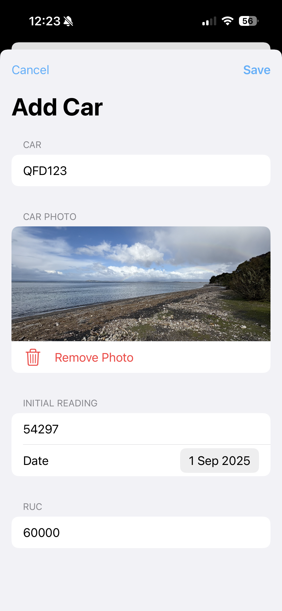
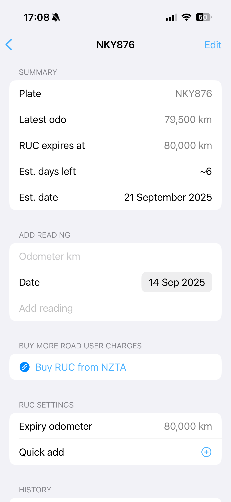
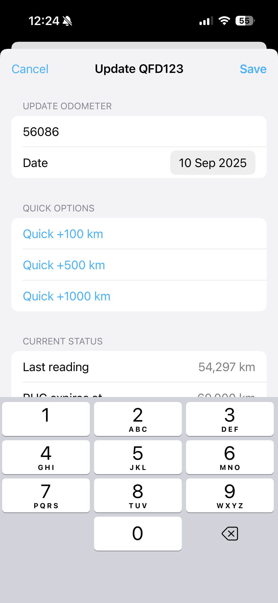

# Rucord

Rucord is a SwiftUI iOS app to track NZ Road User Charges (RUC), WOF, and Registration for one or more vehicles. Add cars by number plate, record odometer readings over time, see how many kilometres remain on your current RUC block, track WOF and registration expiry dates, and get timely reminders before anything expires.

## Features

- Track multiple vehicles by plate
- Set the RUC expiry odometer for each car
- **NEW:** Track WOF and Registration expiry dates (optional)
- Add odometer readings (date + km)
- Clear "km remaining" and projected expiry date based on recent driving
- Due-soon highlighting on cards (<= 500 km or <= 7 days)
- **NEW:** WOF and Registration warnings on car cards when due within 2 months
- Photos on cards and details: pick from library or take a photo; stored locally
- Quick actions:
  - Update Odometer modal with focused input and date picker (+100, +500, +1000 quick options)
  - Detail screen "Quick add" to extend RUC expiry odometer (+1,000, +2,000, +5,000, +10,000)
- Reminders and notifications:
  - 14‑day "RUC due soon" push notification with app badge; badge clears when nothing is near due
  - **NEW:** 6-week advance push notifications for WOF and Registration expiry
  - **NEW:** Smart app badge showing count of cars needing attention  
  - Odometer reading reminders: every 7 days for your first 3 readings, then every 30 days
- NZTA purchase link:
  - "Buy RUC from NZTA" shown on the car card and detail screen when expired or < 30 days remaining
  - Opens https://transact.nzta.govt.nz/v2/purchase-ruc
- **NEW:** WOF and Registration date management in car editing
- Manage cars: edit details, change photo, and delete with confirmation
- Robust local storage: JSON persistence with automatic backup/restore fallback
- Dark Mode support; modern SwiftUI design

## Screenshots

- Home screen with vehicle cards
  
  

- Add car
  
  

- Car detail and editing
  
  

- Update odometer
  
  

## What's New in Version 2

- **WOF and Registration Tracking:** Set expiry dates for WOF and Registration (optional)
- **Enhanced Car Cards:** Show WOF/Registration warnings when due within 2 months, with red text when urgent (< 14 days)
- **Advanced Notifications:** 6-week advance push notifications for WOF and Registration expiry
- **Smart Badge:** App icon badge now shows count of cars needing attention (RUC, WOF, or Registration)
- **Improved UI:** WOF and Registration date pickers in car editing and creation flows

### Previous Updates

- Add "Buy RUC from NZTA" link on car cards and in the car detail screen; shows when RUC is expired or under 30 days remaining.
- Move the detail screen's "Buy RUC" section below "Add reading" for quicker access.
- Odometer reading reminders: every 7 days for your first 3 readings, then every 30 days thereafter.
- 14‑day "RUC due soon" push notifications with app badge; badge clears when nothing is near due.
- Updated screenshots to reflect the latest UI.

## Build and run

Requirements: Xcode 18+ (SwiftUI, iOS 18+ simulator recommended).

- Open `Rucord.xcodeproj` in Xcode and run the `Rucord` scheme.
- Or build via command line:

```bash
xcodebuild -scheme Rucord -project Rucord.xcodeproj -destination 'generic/platform=iOS' build
```

## How it works

- Data models: see [Models.swift](file:///Users/nic/code/mine/rucord/Rucord/Models.swift)
  - `Car` with `plate`, `expiryOdometer`, optional `imageName`, `wofExpiryDate`, `registrationExpiryDate`, and `entries: [OdometerEntry]`
  - Projections: average km/day over recent entries to estimate days left and projected expiry date
- Persistence store: see [CarStore.swift](file:///Users/nic/code/mine/rucord/Rucord/CarStore.swift)
  - Saves/loads JSON in the app's Documents directory; maintains a backup file and restores when needed
  - Keeps the car list sorted by soonest-to-expire (expired first, then projected days, then km remaining, then plate)
- App and UI: see [RucordApp.swift](file:///Users/nic/code/mine/rucord/Rucord/RucordApp.swift), [ContentView.swift](file:///Users/nic/code/mine/rucord/Rucord/ContentView.swift), [Views.swift](file:///Users/nic/code/mine/rucord/Rucord/Views.swift)
  - Home: `CarListView`, cards via `CarRowView`
  - Add: `AddCarView`
  - Detail: `CarDetailView`

## Usage notes

- Units are kilometres.
- "RUC expiry odometer" is the odometer value where your current RUC block ends. The app calculates `distanceRemaining = expiryOdometer - latestOdometer`.
- Projections appear once there are at least two readings to compute a daily average.
- WOF and Registration dates are optional - set them to get expiry warnings and push notifications.

## Roadmap ideas

- Widgets and App Shortcuts
- iCloud/CloudKit sync
- Export/import data
