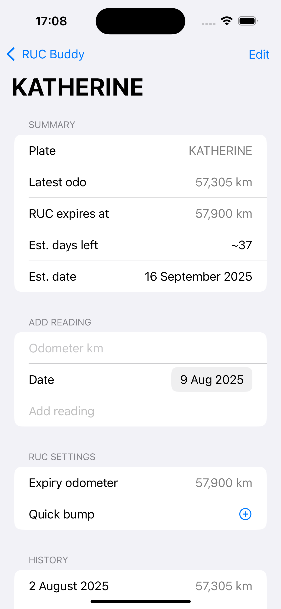
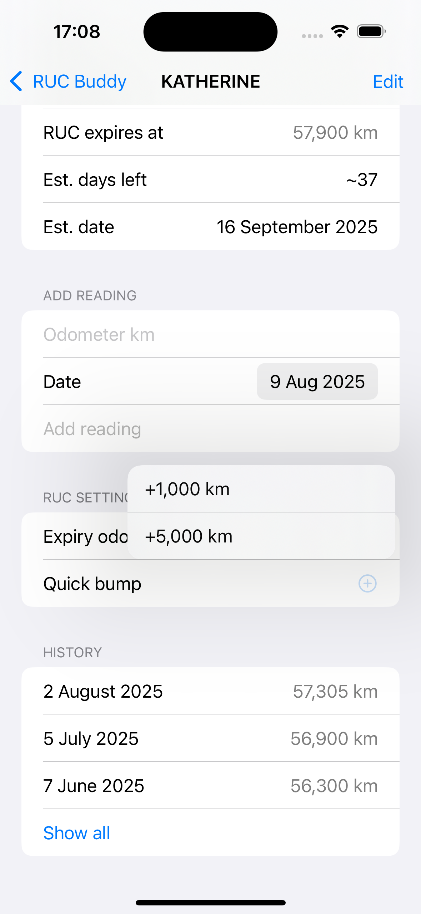

# RUCBuddy

RUCBuddy is a small SwiftUI iOS app to track NZ Road User Charges (RUC) for one or more cars. Add cars by number plate, record odometer readings over time, and see when your current RUC will expire based on your driving.

## Features

- Multiple cars (by plate)
- Set the RUC expiry odometer for each car
- Add odometer readings (date + km)
- Home screen shows:
  - Latest odometer
  - Km remaining to RUC expiry, or projected days and date when enough history exists
  - Due-soon highlighting (<= 500 km or <= 7 days)
- Car detail screen:
  - Summary with projections
  - Quick bump menu to increase expiry odometer by preset amounts (e.g., +1,000, +5,000)
  - History of readings; collapsed by default to the latest 3 with Show all/Show less
- Persistent storage (simple JSON in Documents)

## Screenshots

> The image filenames indicate the screen they represent.

- Home (list of cars)
  
  

- Car detail (summary, add reading, history)
  
  

- Quick bump menu
  
  

- Add car (with initial reading and expiry odometer)
  
  

## Build and run

Requirements: Xcode 15+ (Swift 5, SwiftUI).

- Open `RUCBuddy.xcodeproj` in Xcode and run the `RUCBuddy` scheme on iOS.
- Or build via command line:

```bash
xcodebuild -scheme RUCBuddy -project RUCBuddy.xcodeproj -destination 'generic/platform=iOS' -configuration Debug build
```

Note: The project’s deployment target may be higher than your installed iOS SDK. If you see a warning, lower the target in the project settings.

## How it works

- Data models: see [Models.swift](file:///Users/nic/code/mine/RUCBuddy/RUCBuddy/Models.swift)
  - `Car` with `plate`, `expiryOdometer`, and `entries: [OdometerEntry]`
  - Projection uses average km/day over recent entries to estimate days left and a projected expiry date
- Persistence store: see [CarStore.swift](file:///Users/nic/code/mine/RUCBuddy/RUCBuddy/CarStore.swift)
  - Saves/loads a JSON file in the app’s Documents directory
  - Keeps the car list sorted by soonest-to-expire (expired first, then projected days, then km remaining)
- UI: see [RUCBuddyApp.swift](file:///Users/nic/code/mine/RUCBuddy/RUCBuddy/RUCBuddyApp.swift), [ContentView.swift](file:///Users/nic/code/mine/RUCBuddy/RUCBuddy/ContentView.swift), [Views.swift](file:///Users/nic/code/mine/RUCBuddy/RUCBuddy/Views.swift)
  - Home: `CarListView`
  - Add: `AddCarView`
  - Detail: `CarDetailView`

## Usage notes

- Units are kilometers.
- “RUC expiry odometer” is the odometer value at which your current RUC block ends. The app calculates `distanceRemaining = expiryOdometer - latestOdometer`.
- Projections appear once there are at least two readings to compute a daily average.

## Roadmap ideas

- Notifications when near expiry
- iCloud sync
- Widgets and shortcuts
- Custom quick-bump amounts
