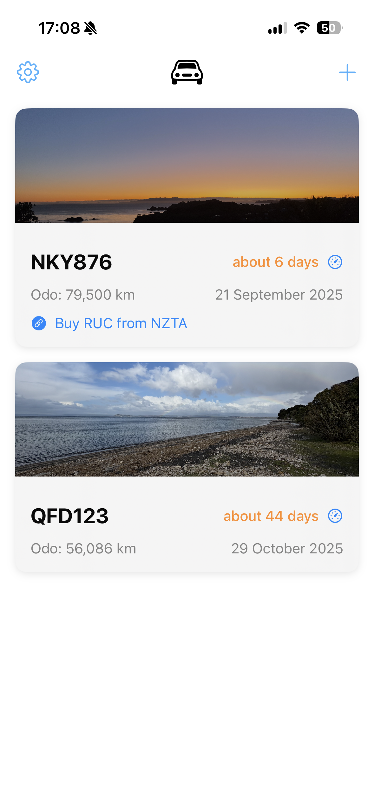

# Rucord

Rucord is a small SwiftUI iOS app to track NZ Road User Charges (RUC) for one or more cars. Add cars by number plate, record odometer readings over time, and see when your current RUC will expire based on your driving.

## Features

- Multiple cars (by plate)
- Set the RUC expiry odometer for each car
- Add odometer readings (date + km)
- Beautiful card-based home screen with:
  - Car images and license plates prominently displayed
  - Latest odometer reading and projected days remaining
  - Due-soon highlighting (<= 500 km or <= 7 days) in orange
  - One-tap "Update Odometer" button on each card
- Quick Update Odometer modal with:
  - Easy odometer entry with date picker
  - Quick increment buttons (+100, +500, +1000 km)
  - Current status overview (last reading, RUC expiry, distance remaining)
- Car detail screen:
  - Summary with projections
  - Quick bump menu to increase expiry odometer by preset amounts (e.g., +1,000, +5,000)
  - History of readings; collapsed by default to the latest 3 with Show all/Show less
- Persistent storage (simple JSON in Documents)

## Screenshots

> The image filenames indicate the screen they represent.

- Home screen with beautiful car cards
  
  

- Settings and about screen
  
  

- Add new car form
  
  

- Car detail screen with editing and history
  
  

- Update Odometer modal with quick options
  
  

## Build and run

Requirements: Xcode 15+ (Swift 5, SwiftUI).

- Open `Rucord.xcodeproj` in Xcode and run the `Rucord` scheme on iOS.
- Or build via command line:

```bash
xcodebuild -scheme Rucord -project Rucord.xcodeproj -destination 'generic/platform=iOS' -configuration Debug build
```

Note: The project’s deployment target may be higher than your installed iOS SDK. If you see a warning, lower the target in the project settings.

## How it works

- Data models: see [Models.swift](file:///Users/nic/code/mine/Rucord/Rucord/Models.swift)
  - `Car` with `plate`, `expiryOdometer`, and `entries: [OdometerEntry]`
  - Projection uses average km/day over recent entries to estimate days left and a projected expiry date
- Persistence store: see [CarStore.swift](file:///Users/nic/code/mine/Rucord/Rucord/CarStore.swift)
  - Saves/loads a JSON file in the app’s Documents directory
  - Keeps the car list sorted by soonest-to-expire (expired first, then projected days, then km remaining)
- UI: see [RucordApp.swift](file:///Users/nic/code/mine/Rucord/Rucord/RucordApp.swift), [ContentView.swift](file:///Users/nic/code/mine/Rucord/Rucord/ContentView.swift), [Views.swift](file:///Users/nic/code/mine/Rucord/Rucord/Views.swift)
  - Home: `CarListView`
  - Add: `AddCarView`
  - Detail: `CarDetailView`

## Usage notes

- Units are kilometers.
- “RUC expiry odometer” is the odometer value at which your current RUC block ends. The app calculates `distanceRemaining = expiryOdometer - latestOdometer`.
- Projections appear once there are at least two readings to compute a daily average.

## Roadmap ideas

- Notifications when near expiry
- iCloud sync
- Widgets and shortcuts
- Custom quick-bump amounts
