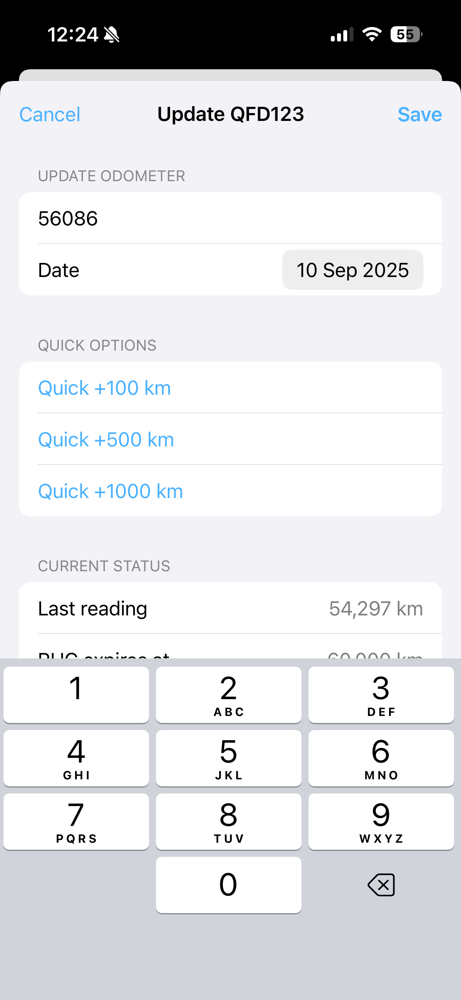

# Rucord — Simple NZ Road User Charges tracking

Rucord helps New Zealand drivers stay on top of Road User Charges (RUC). Track odometer readings for one or more vehicles, see exactly how many kilometres remain on your current RUC block, and get timely reminders before you run out.

## Why Rucord

- Stay compliant: always know when your current RUC will run out
- Be proactive: reminders help you log readings and top up RUC before it’s urgent
- Clear, fast, modern: SwiftUI design with Dark Mode and photo headers for each car
- Private by default: your data stays on your device (with automatic local backup)

## Key features

- Multiple vehicles (by plate)
- Clear “km remaining” until your current RUC block expires
- Smart projections: estimated days remaining based on recent driving
- Reminders and notifications:
  - Odometer reading reminders: every 7 days for your first 3 readings, then every 30 days thereafter
  - 14‑day “RUC due soon” push notification with app badge (badge clears when nothing is near due)
- Fast entry:
  - Update Odometer modal focuses the input and includes quick options (+100, +500, +1000)
  - Detail screen “Quick add” to extend your RUC expiry odometer (+1,000 / +2,000 / +5,000 / +10,000)
- Buy RUC from NZTA: a handy link appears when your RUC is expired or < 30 days remaining
- Personalise with photos: pick from your library or take a photo; stored locally on device

## How it works

1. Add a vehicle with its number plate, current odometer, and RUC expiry odometer
2. Enter odometer readings as you drive (or use quick options)
3. Rucord projects your remaining days and shows your “km remaining” at a glance
4. Get reminders to log readings and a heads‑up when you’re 14 days from expiry
5. Tap the NZTA link to top up when you’re close or expired

## Screenshots

- Home screen with vehicle cards

  

- Add car

  

- Car detail and editing

  

- Update odometer

  

## Privacy-first by design

- No accounts, no tracking, no ads
- All data is stored locally as JSON in your app Documents folder
- Automatic local backup before each save for extra safety

## Who it’s for

- NZ drivers of diesel vehicles, light trucks, motorhomes, or any vehicle that uses RUC
- Fleets and families who want a simple, reliable way to keep RUC up to date

## Get Rucord

RUC made simple. Track, project, and top up before it’s urgent.

- Coming soon to the App Store
- Questions or feedback? Open an issue on GitHub
